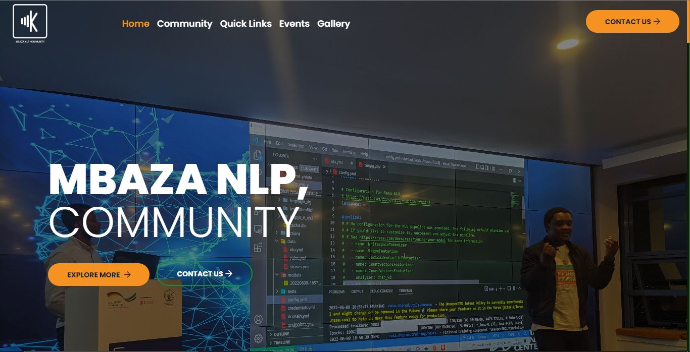

[![Contributors][contributors-shield]][contributors-url]
[![Forks][forks-shield]][forks-url]
[![Stargazers][stars-shield]][stars-url]
[![Issues][issues-shield]][issues-url]
[![Slack][slack-shield]][slack-url]

<!-- PROJECT LOGO -->
 

  

  <h3 align="center">MBAZA NLP Community website</h3>

  

    A guide on how to contribute to the community website!
     
    <a href="https://www.mbaza.org">View Website</a>
    ·
    <a href="https://github.com/MBAZA-NLP/community.website/issues">Report Bug</a>
    ·
    <a href="https://github.com/MBAZA-NLP/community.website/issues">Request Feature</a>
  

<!-- ABOUT THE PROJECT -->
## About The Project

    

The website aims to showcase our work as community including the upcomming events, ongoing projects, members of the community and means to communication we use.

Main Objectives:
* Gallery of Past events
* Community members profiles
* Past & Upcoming events such as meetups hackathons
* Ongoing Projects
* Contact Page
* Blog

(<a href="#readme-top">back to top</a>)

<!-- GETTING STARTED -->
## Getting Started

We welcome any contribution to the website and community as a whole. Bellow is an introduction on how to get started.

Contribution areas:
* Content Creator: We look forward to onboarding a content creator for our blog.
* Content Moderator: We look forward to onboarding a content creator for our blog.

Please feel free to also suggest any other area you might be intrested to contribute

### Built With

The community website is built with the following stack. You are also welcome to suggest other stack to include!

[![Bootstrap][Bootstrap.com]][Bootstrap-url]
[![JQuery][JQuery.com]][JQuery-url]

(<a href="#readme-top">back to top</a>)

### Prerequisites

To be honest, there are no pre-requisite :)

<!-- ROADMAP -->
## Roadmap

- [x] Add Ghost CMS
- [x] Add README.md to the community website

See the [open issues](https://github.com/MBAZA-NLP/community.website/issues) for a full list of proposed features (and known issues).

(<a href="#readme-top">back to top</a>)

<!-- CONTRIBUTING -->
## Contributing

Contributions are what make the open source community such an amazing place to learn, inspire, and create. Any contributions you make are **greatly appreciated**.

If you have a suggestion that would make this better, please fork the repo and create a pull request. You can also simply open an issue with the tag "enhancement".
Don't forget to give the project a star! Thanks again!

1. Fork the Project
2. Create your Feature Branch (`git checkout -b AmazinFeature`)
3. Commit your Changes (`git commit -m 'Add some AmazingFeature'`)
4. Push to the Branch (`git push origin dev`)
5. Open a Pull Request to the dev branch

(<a href="#readme-top">back to top</a>)

<!-- CONTACT -->
## Contact

* Isaac Manzi - isaac.manzi@giz.de
* Samuel Rutunda - samuel@digitalumuganda.com

(<a href="#readme-top">back to top</a>)

<!-- MARKDOWN LINKS & IMAGES -->
<!-- https://www.markdownguide.org/basic-syntax/#reference-style-links -->
[contributors-shield]: https://img.shields.io/github/contributors/othneildrew/Best-README-Template.svg?style=for-the-badge
[contributors-url]: https://github.com/MBAZA-NLP/community.website/graphs/contributors
[forks-shield]: https://img.shields.io/github/forks/othneildrew/Best-README-Template.svg?style=for-the-badge
[forks-url]: https://github.com/MBAZA-NLP/community.website/network/members
[stars-shield]: https://img.shields.io/github/stars/othneildrew/Best-README-Template.svg?style=for-the-badge
[stars-url]: https://github.com/othneildrew/Best-README-Template/stargazers
[issues-shield]: https://img.shields.io/github/issues/othneildrew/Best-README-Template.svg?style=for-the-badge
[issues-url]: https://github.com/MBAZA-NLP/community.website/issues
[slack-shield]: https://img.shields.io/badge/Slack-4A154B?style=for-the-badge&logo=slack&logoColor=white
[slack-url]: https://join.slack.com/t/mbazanlpcommunity/shared_invite/zt-1e5mxv2x2-XH25edKoZ4tFZou4SvLsQA
[Bootstrap.com]: https://img.shields.io/badge/Bootstrap-563D7C?style=for-the-badge&logo=bootstrap&logoColor=white
[Bootstrap-url]: https://getbootstrap.com
[JQuery.com]: https://img.shields.io/badge/jQuery-0769AD?style=for-the-badge&logo=jquery&logoColor=white
[JQuery-url]: https://jquery.com 
